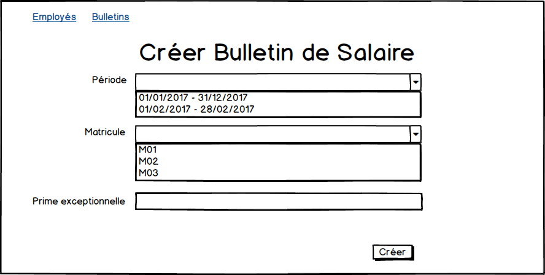

# Travaux Pratiques

## Projet SIRH - Gestion de la paie
Notre objectif est de créer une application de génération d'un bulletin de salaire.





## Mise en place de l'environnement de développement

### Librairies supplémentaires

* Ajouter la dépendance vers _Spring WebMVC_ :

```xml
<dependency>
	<groupId>org.springframework</groupId>
	<artifactId>spring-webmvc</artifactId>
</dependency>
```

* La technologie de vue choisie est _JSP_. Nous allons ajouter une dépendance vers l'API Servlet.

```xml
<dependency>
	<groupId>javax.servlet</groupId>
	<artifactId>javax.servlet-api</artifactId>
	<version>3.1.0</version>
	<scope>provided</scope>
</dependency>
```

Vous vous souvenez pourquoi _<scope>provided</scope>_ ?

* La librairie de tag _JSTL_ sera utilisée dans les pages JSP. Ajouter la dépendance suivante :

```xml
<dependency>
	<groupId>jstl</groupId>
	<artifactId>jstl</artifactId>
	<version>1.2</version>
</dependency>
```

* Si ce n'est pas déjà fait, ajouter la dépendance vers _hibernate-java8_ pour le support des dates Java 8 dans les mappings _JPA_ :

```xml
<dependency>
	<groupId>org.hibernate</groupId>
	<artifactId>hibernate-java8</artifactId>
	<version>${hibernate.version}</version>
	<scope>runtime</scope>
</dependency>
```

### Conteneur de Servlet

Pour déployer l'application _sirh-gestion-paie_, nous allons utiliser le conteneur de servlet _Apache Tomcat_.

* Télécharger Tomcat : https://tomcat.apache.org/download-80.cgi (version 8.5.15, rubrique _Core > zip_). Décompresser l'archive.

* Créer un fichier _src/main/webapp/index.html_ : 

```html
<!DOCTYPE html>
<html>
<head>
<meta charset="UTF-8">
<title>PAIE</title>
</head>
<body>
	<h1>SIRH - Gestion de la paie</h1>
</body>
</html>
```

* Déployer depuis STS l'application Web sous Tomcat. Comment on fait ? Vous allez trouver j'en suis sûr, souvenez-vous du cours de Java EE ;-)

* Vérifier que la page web s'affiche dans le navigateur.

* Profitez de l'occasion pour ajouter _Twitter Bootstrap_ au projet.

### Mise en place de Spring MVC

* Créer la classe de configuration _dev.paie.config.WebAppConfig_ :

```java
@Configuration
@EnableWebMvc
@ComponentScan("dev.paie.web.controller")
public class WebAppConfig {

	@Bean
	public ViewResolver viewResolver() {
		return new InternalResourceViewResolver("/WEB-INF/views/", ".jsp");
	}

}
```

* Créer un contrôleur : _dev.paie.web.controller.RemunerationEmployeController_ :


```java
@Controller
@RequestMapping("/employes")
public class RemunerationEmployeController {

	@RequestMapping(method = RequestMethod.GET, path = "/creer")
	public ModelAndView creerEmploye() {
		ModelAndView mv = new ModelAndView();
		mv.setViewName("employes/creerEmploye");
		mv.addObject("prefixMatricule","M00");
		return mv;
	}

}
```

* Créer un fichier _src/main/webapp/WEB-INF/views/employes/creerEmploye.jsp_ avec le contenu suivant :

```html
<h1>Créer Employe</h1>
<p>Préfixe Matricule : ${prefixMatricule}</p>
```

* Créer la classe de démarrage de Spring MVC _dev.paie.web.WebAppInitializer_ :

```java
package dev.paie.web;

import javax.servlet.ServletContext;
import javax.servlet.ServletException;
import javax.servlet.ServletRegistration;

import org.springframework.web.WebApplicationInitializer;
import org.springframework.web.context.ContextLoaderListener;
import org.springframework.web.context.support.AnnotationConfigWebApplicationContext;
import org.springframework.web.servlet.DispatcherServlet;

import dev.paie.config.WebAppConfig;

public class WebAppInitializer implements WebApplicationInitializer {

	@Override
	public void onStartup(ServletContext servletContext) throws ServletException {

		// Initialisation du contexte Spring
        AnnotationConfigWebApplicationContext webContext = new AnnotationConfigWebApplicationContext();
        webContext.register(WebAppConfig.class);

        /*
        <servlet>
                <servlet-name>dispatcher</servlet-name>
                <servlet-class>org.springframework.web.servlet.DispatcherServlet</servlet-class>
                <load-on-startup>1</load-on-startup>
        </servlet>
         */
        ServletRegistration.Dynamic dispatcher = servletContext.addServlet("dispatcher", new DispatcherServlet(webContext));
        dispatcher.setLoadOnStartup(1);

        /*
        <servlet-mapping>
                <servlet-name>dispatcher</servlet-name>
                <url-pattern>/mvc/*</url-pattern>
        </servlet-mapping>
         */
        dispatcher.addMapping("/mvc/*");

        /*
        <listener>
            <listener-class>org.springframework.web.context.ContextLoaderListener</listener-class>
        </listener>
        */
        servletContext.addListener(new ContextLoaderListener(webContext));
	}
}
```

* Redémarrer l'application et tester la page : http://localhost:8080/paie/mvc/employes/creer. Vous devriez avoir le résultat suivant :


## Jeux de données

Nous allons modifier l'application pour avoir le comportement suivant : à chaque redémarrage, le schéma de base de données est supprimé puis recréé et enfin un jeux de données est inséré.

### Drop And Create
Modifions la configuration JPA pour activer le mode _drop-and-create_ de JPA.

* Modifier la classe _dev.paie.config.JpaConfig_ comme suit :

```java
...
public class JpaConfig {
	...
	@Bean
	// Cette configuration nécessite une source de données configurée.
	// Elle s'utilise donc en association avec un autre fichier de configuration
	// d éfinissant un bean DataSource.
	public EntityManagerFactory entityManagerFactory(DataSource dataSource) {
		HibernateJpaVendorAdapter vendorAdapter = new HibernateJpaVendorAdapter();
		//vendorAdapter.setGenerateDdl(true); <1>
		// activer les logs SQL
		vendorAdapter.setShowSql(true);
		LocalContainerEntityManagerFactoryBean factory = new LocalContainerEntityManagerFactoryBean();
		factory.setJpaVendorAdapter(vendorAdapter);
		// alternative au persistence.xml
		factory.setPackagesToScan("dev.paie.entite");
		factory.setDataSource(dataSource);
		Properties jpaProperties = new Properties(); <2>
		jpaProperties.setProperty("javax.persistence.schema-generation.database.action", "drop-and-create");<2>
		factory.setJpaProperties(jpaProperties);<2>
		factory.afterPropertiesSet();
		return factory.getObject();
	}
}

```
<1> Mettre un commentaire sur cette ligne

<2> Configurer le mode _drop-and-create_.

* Vérifier que les données sont bien supprimées entre 2 redémarrages.

### Service _InitialiserDonneesService_

* Créer une interface _dev.paie.service.InitialiserDonneesService_.

```java
package dev.paie.service;

public interface InitialiserDonneesService {
	void initialiser();
}
```

* Créer un écouteur de démarrage d'une application Spring

> Cette classe doit faire partie du contexte Spring pour fonctionner.


```java
package dev.paie.web.listener;

import org.springframework.beans.factory.annotation.Autowired;
import org.springframework.context.event.ContextRefreshedEvent;
import org.springframework.context.event.EventListener;
import org.springframework.stereotype.Component;

import dev.paie.service.InitialiserDonneesService;

@Component
public class StartUpAppListener {

	@Autowired
	private InitialiserDonneesService initService;

	@EventListener(ContextRefreshedEvent.class)
	public void contextRefreshedEvent() {
		// capture du démarrage de l'application
		// à un moment où le contexte Spring est complètement créé
		initService.initialiser();
	}
}
```

* Créer une implémentation de ce service _dev.paie.service.InitialiserDonneesServiceDev_ qui insère les données suivantes :
 * Cotisations
 * Entreprises
 * Grade
 * ProfilRemuneration
 * Periode

Pour vous éviter une saisie fastidieuse des données, je vous fournis les fichiers suivants : `cotisations-imposables.xml`, `cotisations-non-imposables.xml`,
`entreprises.xml`, `grades.xml`, `profils-remuneration.xml`.

A vous de récupérer ces données et les insérer programmatiquement en base de données.

Pas de XML pour les périodes ? Exact ! Vous allez générer 12 périodes programmatiquement de l'année courante.

Pour 2017, vous aurez par exemple :

```
1  -> 2017-01-01 - 2017-01-31
2  -> 2017-02-01 - 2017-02-28
3  -> 2017-03-01 - 2017-03-31
4  -> 2017-04-01 - 2017-04-30
5  -> 2017-05-01 - 2017-05-31
6  -> 2017-06-01 - 2017-06-30
7  -> 2017-07-01 - 2017-07-31
8  -> 2017-08-01 - 2017-08-31
9  -> 2017-09-01 - 2017-09-30
10 -> 2017-10-01 - 2017-10-31
11 -> 2017-11-01 - 2017-11-30
12 -> 2017-12-01 - 2017-12-31
```

* Ecrivez tout le code nécessaire pour insérer toutes les données au démarrage de l'application.


## Page Créer employé

* Implémenter la page de création d'un employé.


## Page Lister employés

* Implémenter la page de liste des employés.


## Page Créer bulletin

* Implémenter la page génération d'un bulletin de salaire.


## Page Lister bulletin

* Implémenter la page de liste de bulletins.


## Page Visualiser bulletin

* Implémenter la page de visualisation de bulletin.


